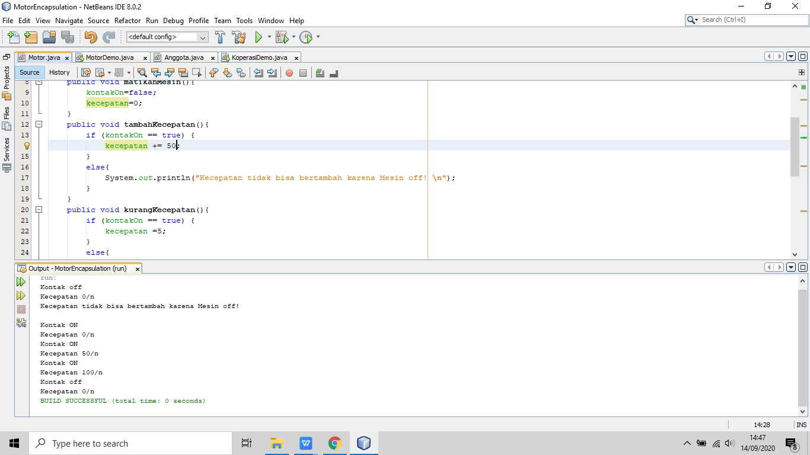

#MARKDOWN#PERCOBAAN3
3.3 Pertanyaan 
1. Pada class TestMobil, saat kita menambah kecepatan untuk pertama kalinya, mengapa muncul peringatan “Kecepatan tidak bisa bertambah karena Mesin Off!”? 
  Jawab=ya karena mesin mati jadi tidak ada penambahan percepatan
2.Mengapat atribut kecepatan dan kontakOn diset private? 
  Jawab=karena untuk mengetahui agar data yang ditampilkan masih berada di class yang sama
3.

Tambah kecepatan menjadi 50 maka akan menjadi 100 pada kecepatan maks

3.6 Pertanyaan – Percobaan 3 dan 4 
1. Apa yang dimaksud getter dan setter? 
Jawab=getter merupakan public method dan punya tipe data return,yang funsgsinya untuk mendapatkan nilai dari attribut private.
2.Apa kegunaan dari method getSimpanan()?
Jawab=untuk melakukan transaksi setor dan pinjam/tarik
 
3.Method apa yang digunakan untuk menambah saldo?
Jawab=method setor 
4.Apa yand dimaksud konstruktor?
Jawab=method yang dikhususkan saat pembuatan objek
 
5.Sebutkan aturan dalam membuat konstruktor?
Jawab=-konstruktor harus sama dengan nama class
   -konstruktor tidak boleh menggunakan modifier abstract,final,static dan 		   syncronized 
-tidak punya data return
6.Apakah boleh konstruktor bertipe private?
Jawab= Tidak
7.Kapan menggunakan parameter dengan passsing parameter? 
Jawab=Pasiing parameter untuk menginputkan data dan paramater itu digunakan di konstruktor
8.Apa perbedaan atribut class dan instansiasi atribut?
Jawab=atribut class digunakan untuk memberi nama pada nilai dan instansiasi atribut untuk memanggil atribut 
9.Apa perbedaan class method dan instansiasi method? 
Jawab=Class method digunakan untuk mengolah data atau sifat yang bisa dilakukan dalam class, intansiasi method digunakan untuk memanggil method yang ada dalam class.
